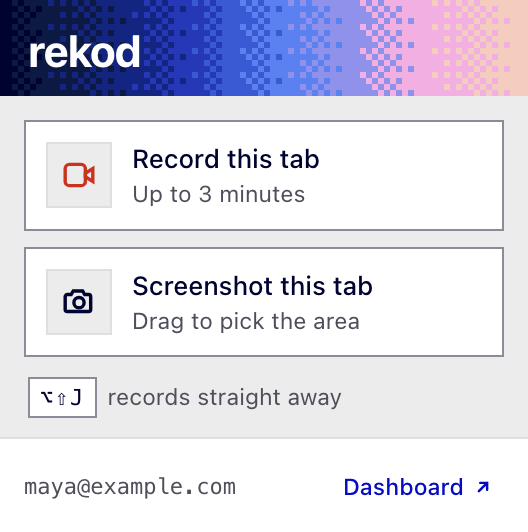

<p align="center">
  
</p>

<h1 align="center">
  
  rekod
</h1>

<p align="center">
  <b>Bug reports that already know what happened.</b><br>
  Record a tab and rekod brings the five minutes before it: console, network and video on one timeline.
</p>

<p align="center">
  <a href="#quick-start">Quick start</a> ·
  <a href="apps/extension/README.md">Extension</a> ·
  <a href="ROADMAP.md">Roadmap</a> ·
  <a href="REKOD_DESIGN_SYSTEM.md">Design system</a>
</p>

<p align="center">
  
</p>

---

## What it does

- **Chrome extension (MV3).** Records a tab (video) or takes a screenshot, with
  the previous 5 minutes of console and network traffic already captured.
  Secrets are redacted in the page before anything leaves the tab. Nothing is
  uploaded until you press Send.
- **Web app (Next.js).** The dashboard and the whole backend. Plays the video
  and the log on one timeline, and shares a rekod by read-only link. Runs on any
  Postgres (Drizzle) and any S3-compatible bucket, with Better Auth and Google
  sign-in.

The extension has no sign-in of its own; it reads the dashboard's session
cookie.

## Repo layout

| Path | What it is |
|---|---|
| [`apps/extension/`](apps/extension/) | Vanilla JS, MV3. No build step, no dependencies: the source is what ships. |
| [`apps/web/`](apps/web/) | Next.js 16, React 19, Tailwind 4. The only pnpm workspace package. |

The two share no code. The lockfile and `node_modules` live at the repo root.

## Quick start

Requires Node, pnpm and Docker.

```sh
# 1. dependencies
pnpm install

# 2. local Postgres (:5432) and S3 (:8333)
docker compose -f docker-compose.dev.yml up

# 3. config: copy and fill in
cp apps/web/.env.example apps/web/.env.local

# 4. create the bucket once, then apply migrations
curl -X PUT http://localhost:8333/rekod
pnpm -C apps/web db:migrate

# 5. dashboard on http://localhost:3100
pnpm dev
```

In `.env.local`, set `BETTER_AUTH_SECRET` (`openssl rand -base64 32`) and
`GOOGLE_CLIENT_ID` / `GOOGLE_CLIENT_SECRET`. Google is the only sign-in, so
without both nobody can log in. Google's redirect URI is
`<BETTER_AUTH_URL>/api/auth/callback/google`.

**Extension:** open `chrome://extensions`, turn on Developer mode, click
**Load unpacked** and pick [`apps/extension/`](apps/extension/). Never pick the
repo root: Chrome loads everything under the folder, and the root holds
`node_modules` and `.env` files. Sign in on the dashboard first.

## Choose your database

Postgres is the default. MongoDB works too; the `DATABASE_URL` scheme picks it,
and nothing else changes.

| | `DATABASE_URL` | Setup |
|---|---|---|
| Postgres | `postgres://…` | `pnpm -C apps/web db:migrate` |
| MongoDB 6+ | `mongodb://…` or `mongodb+srv://…` | None: collections and indexes are created on first use. A standalone server is enough. |

For a local MongoDB: `docker compose -f docker-compose.dev.yml --profile mongo up`.
There is no migration between the two; pick one before you have data. See
[`ADAPTERS.md`](ADAPTERS.md). Any S3-compatible bucket works for files, GCS
included (`S3_ENDPOINT=https://storage.googleapis.com`, `S3_REGION=auto`, HMAC keys).

## Checks

```sh
pnpm test        # timeline logic and the tenant-isolation test, on both databases
pnpm typecheck
pnpm lint
pnpm build
```

CI runs exactly these. The tenancy test needs no database or bucket; it runs
against PGlite and an in-memory MongoDB with a fake S3.

## Docs

| File | Contents |
|---|---|
| [`CLAUDE.md`](CLAUDE.md) | How the system works today: server boundary, upload flow, extension invariants. |
| [`ADAPTERS.md`](ADAPTERS.md) | The Postgres / MongoDB adapter design. |
| [`ROADMAP.md`](ROADMAP.md) | The plan and a progress log of what has landed. |
| [`REKOD_DESIGN_SYSTEM.md`](REKOD_DESIGN_SYSTEM.md) | The UI's authority: tokens, type, components. |
| [`apps/extension/README.md`](apps/extension/README.md) | Installing and using the extension. |
